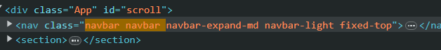

Project start from \public\index.html

React app mount from id in src\index.js

First component is **Preload** using settiemout

Then is navbar component just basic 

then is react router 

**style** in react can use built-in component class without define
 

Particles component use to define star background

